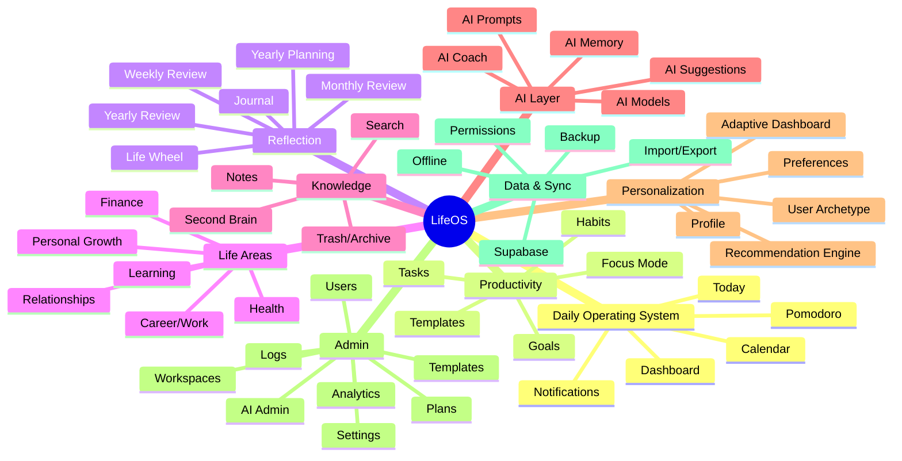
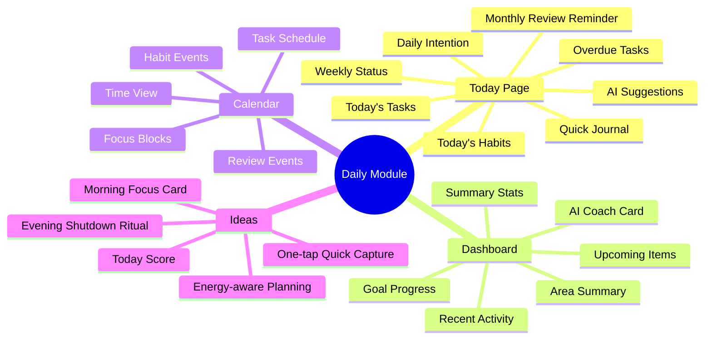
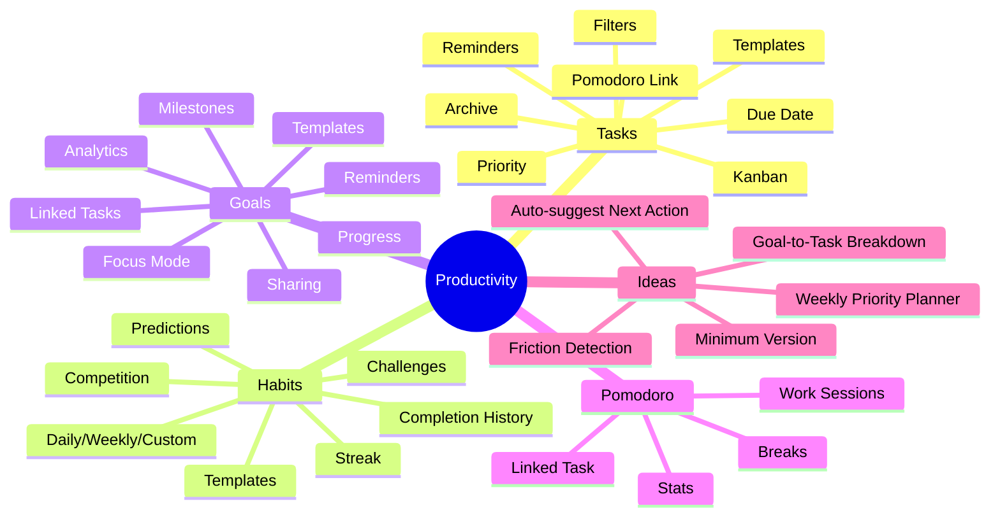
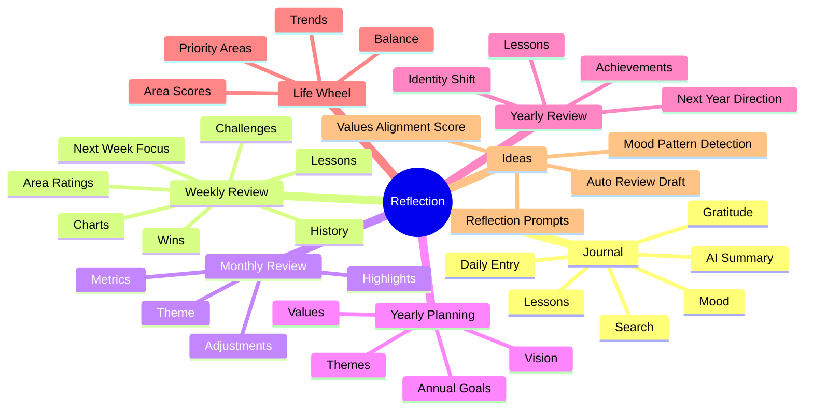
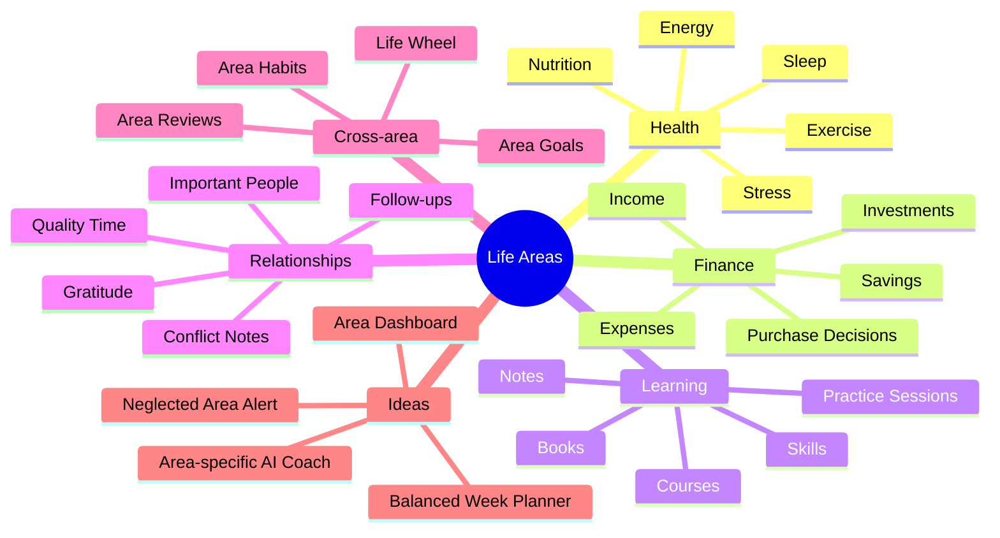
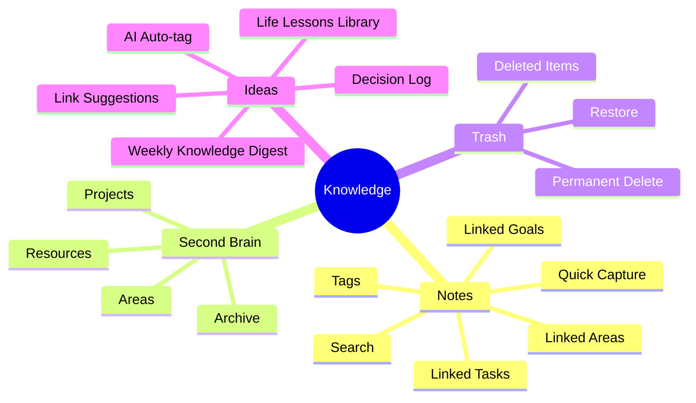
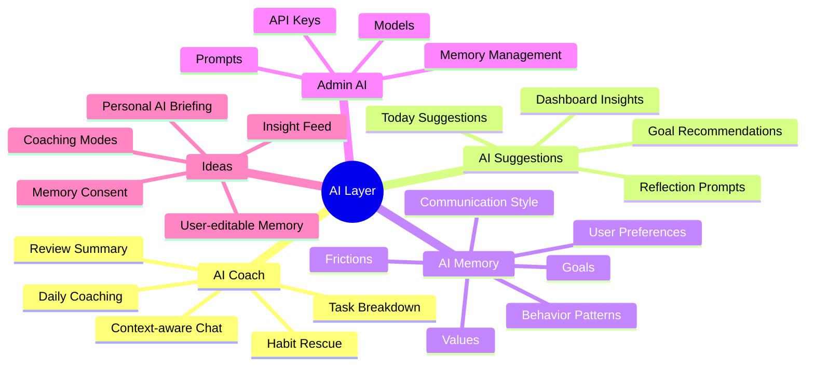
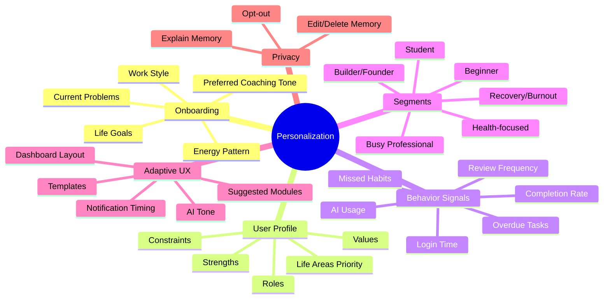
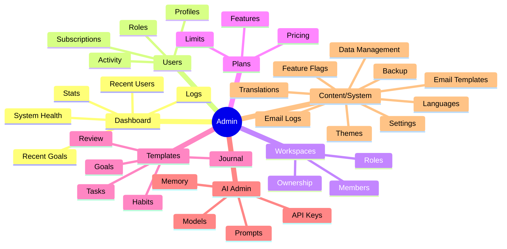

# LifeOS Module Mindmap & Personalization Plan

Tài liệu này tổng hợp rà soát cấu trúc ứng dụng LifeOS hiện tại, mindmap theo từng module, ý tưởng phát triển mới, và plan cá nhân hóa trải nghiệm cho từng người dùng.

## 1. Mục tiêu sản phẩm

LifeOS nên trở thành **hệ điều hành cá nhân hằng ngày** cho người dùng, không chỉ là app ghi task/habit.

Trọng tâm:

- Giúp người dùng biết hôm nay nên làm gì
- Giúp người dùng sống đúng mục tiêu dài hạn
- Giúp người dùng phản chiếu bản thân đều đặn
- Giúp AI hiểu từng người dùng và đưa gợi ý phù hợp
- Giảm ma sát nhập liệu, tăng giá trị insight

## 2. Research notes áp dụng vào LifeOS

### 2.1 Tiny Habits / Behavior Design

Nguyên tắc nên áp dụng:

- Hành vi bền vững cần **prompt + khả năng thực hiện dễ + động lực vừa đủ**
- Mỗi habit nên có phiên bản nhỏ nhất
- App nên nhắc đúng thời điểm, không spam
- Khi người dùng miss habit, nên giảm độ khó thay vì chỉ cảnh báo

Ứng dụng vào LifeOS:

- Thêm field `minimum_version` cho habit
- Morning/evening check-in siêu ngắn
- Notification dạng câu hỏi: "Bạn muốn làm phiên bản nhỏ nhất hôm nay không?"
- AI đề xuất cách giảm friction khi người dùng bỏ lỡ liên tục

### 2.2 Personal Informatics / Quantified Self

Một hệ thống self-tracking tốt thường có vòng lặp:

1. Chuẩn bị mục tiêu muốn theo dõi
2. Thu thập dữ liệu
3. Tích hợp dữ liệu từ nhiều nơi
4. Phản chiếu bằng chart/insight
5. Hành động điều chỉnh

Ứng dụng vào LifeOS:

- Không chỉ hiển thị số liệu, phải có **insight và next action**
- Weekly/Monthly/Yearly Review nên tự tổng hợp từ task, habit, goal, journal
- Dashboard nên ưu tiên câu hỏi: "Điều gì cần điều chỉnh?"

### 2.3 Second Brain / PARA

PARA gồm:

- Projects: việc có deadline/kết quả cụ thể
- Areas: lĩnh vực cần duy trì lâu dài
- Resources: kiến thức/tham khảo
- Archives: thứ không còn active

Ứng dụng vào LifeOS:

- Goals/Tasks = Projects
- Life Areas = Areas
- Notes/Learning = Resources
- Trash/Archived = Archives
- AI nên giúp liên kết notes với goals/tasks/life areas

### 2.4 AI Personalization

Cá nhân hóa tốt cần:

- Onboarding hỏi ít nhưng đúng
- Theo dõi hành vi sử dụng
- Phân nhóm người dùng theo phong cách
- Gợi ý thay đổi theo dữ liệu thực tế
- Cho người dùng quyền xem/sửa/xóa memory

Ứng dụng vào LifeOS:

- AI Memory nên lưu preference, pattern, friction, goal, values
- Dashboard khác nhau theo từng user archetype
- Prompt AI cần nhận context: mục tiêu, habit miss, task quá hạn, mood, energy, calendar

## 3. Mindmap tổng quan ứng dụng



## 4. Mindmap theo module

## 4.1 Daily Module: Today / Dashboard / Calendar



### Ý tưởng bổ sung

- **Today Focus:** 1 mục tiêu chính, 3 việc quan trọng, 1 habit ưu tiên, 1 điều cần tránh
- **Morning Setup Wizard:** mở app buổi sáng sẽ hỏi 3 câu ngắn
- **Evening Shutdown:** cuối ngày hỏi hoàn thành gì, học được gì, ngày mai chỉnh gì
- **Contextual Empty State:** nếu chưa có task/habit thì gợi ý tạo bằng template cá nhân hóa
- **Adaptive Today:** người mới thấy hướng dẫn, người dùng lâu thấy insight nâng cao

## 4.2 Productivity Module: Tasks / Habits / Goals / Pomodoro



### Ý tưởng bổ sung

- **Minimum Habit:** mỗi habit có bản tối thiểu để chống bỏ cuộc
- **Friction Detection:** nếu task quá hạn nhiều ngày, AI hỏi lý do: mơ hồ, quá lớn, không còn quan trọng, thiếu năng lượng
- **Goal Breakdown:** AI chuyển goal thành milestones + tasks + habits
- **Weekly Priority Planner:** chọn 1-3 outcome quan trọng tuần này
- **Task Aging:** task để quá lâu sẽ yêu cầu quyết định: làm, delegate, schedule, delete
- **Habit Rescue Mode:** khi miss 2-3 ngày, app đề xuất bản nhẹ hơn

## 4.3 Reflection Module: Journal / Reviews / Life Wheel



### Ý tưởng bổ sung

- **Auto Review Draft:** AI tạo bản nháp weekly/monthly review từ dữ liệu thật
- **Mood Pattern:** phát hiện ngày/tuần nào năng lượng thấp, liên quan habit/task nào
- **Values Alignment:** goal/task có đang khớp với giá trị sống không
- **Review Reminder:** nếu gần cuối tuần/tháng, Today hiển thị card review
- **Reflection Prompt Engine:** prompt khác nhau theo trạng thái người dùng

## 4.4 Life Areas Module: Health / Finance / Learning / Relationships



### Ý tưởng bổ sung

- **Area Dashboard:** mỗi lĩnh vực có score, trend, next action
- **Neglected Area Alert:** nếu 2-3 tuần không có action trong một area thì nhắc nhẹ
- **Relationship CRM nhẹ:** nhắc liên hệ người quan trọng, lưu insight quan hệ
- **Finance Decision Log:** ghi các quyết định mua/sell/invest và review lại sau
- **Learning Path:** từ mục tiêu học tập → kỹ năng → bài học → practice habit

## 4.5 Knowledge Module: Notes / Second Brain / Trash



### Ý tưởng bổ sung

- **Quick Capture Inbox:** nhập nhanh mọi ý tưởng trước, phân loại sau
- **AI Auto-tag:** tự đề xuất tag/area/goal liên quan
- **Decision Log:** lưu quyết định quan trọng để review chất lượng quyết định
- **Life Lessons Library:** gom các bài học từ journal/review thành tri thức cá nhân
- **Weekly Knowledge Digest:** mỗi tuần AI tóm tắt notes quan trọng

## 4.6 AI Module: AI Coach / AI Memory / AI Admin



### Ý tưởng bổ sung

- **Coaching Modes:** Direct Coach, Gentle Coach, Strategic Coach, Therapist-like Reflection, Execution Partner
- **Personal AI Briefing:** mỗi sáng AI nói: hôm nay nên tập trung gì, vì sao
- **Memory Consent:** khi AI học điều mới, hỏi "Lưu điều này vào memory không?"
- **Memory Review:** hàng tháng cho user xem AI đang biết gì về mình
- **Insight Feed:** stream insight ngắn thay vì chỉ chat

## 4.7 Personalization Module



### Ý tưởng bổ sung

- **User Archetype Quiz:** 5 câu để phân loại người dùng ban đầu
- **Personalization Settings:** người dùng chọn tone AI, độ chi tiết, khung giờ nhắc
- **Adaptive Dashboard:** module nào dùng nhiều thì nổi lên, module ít dùng thì gom lại
- **Smart Defaults:** template/habit/task mặc định theo archetype
- **Personal Operating Manual:** AI tạo một trang "cách tôi vận hành tốt nhất"

## 4.8 Admin Module



### Ý tưởng bổ sung

- **Admin Insight:** top features used, drop-off modules, users needing onboarding help
- **Template Marketplace:** admin tạo template theo archetype
- **AI Prompt A/B Testing:** so sánh prompt nào giúp user hoàn thành nhiều hơn
- **User Health Score:** admin xem user có đang active/at-risk không
- **Feature Adoption Dashboard:** module nào được dùng nhiều/ít

## 5. Cá nhân hóa cho từng người dùng

## 5.1 Dữ liệu cá nhân hóa nên lưu

### Explicit preferences do user nhập

- Tên gọi ưa thích
- Ngôn ngữ
- Tone AI: nhẹ nhàng, trực diện, chiến lược, ngắn gọn, chi tiết
- Khung giờ năng lượng cao
- Giờ ngủ/thức
- Mục tiêu chính năm nay
- Life areas ưu tiên
- Notification preference
- Work style: deep work, sprint ngắn, checklist, calendar-based

### Implicit signals từ hành vi

- Người dùng mở app lúc nào
- Module nào dùng nhiều nhất
- Task thường overdue loại nào
- Habit nào miss nhiều nhất
- Review có đều không
- AI prompt nào được dùng nhiều
- Thời điểm hoàn thành task/habit
- Tỷ lệ hoàn thành theo ngày trong tuần

### AI Memory nên lưu

- Preferences: "thích checklist ngắn"
- Patterns: "hay trì hoãn task mơ hồ"
- Goals: "ưu tiên sức khỏe và tài chính"
- Frictions: "buổi tối thường mệt, không nên lên task nặng"
- Values: "tự do, sức khỏe, gia đình"
- Communication style: "không thích lời khuyên chung chung"

## 5.2 User archetypes đề xuất

| Archetype | Nhu cầu chính | Dashboard nên ưu tiên | AI nên nói kiểu |
|---|---|---|---|
| Beginner | Bắt đầu xây routine | Today Focus, habit gợi ý | Nhẹ, hướng dẫn từng bước |
| Busy Professional | Quản lý công việc và năng lượng | 3 priorities, calendar, overdue | Ngắn, quyết đoán |
| Builder/Founder | Goal, project, execution | Goals, tasks, deep work, metrics | Chiến lược, outcome-based |
| Student/Learner | Học tập, deadline | Learning, tasks, pomodoro | Khích lệ, có kế hoạch học |
| Health-focused | Habit sức khỏe | Health, habits, sleep/energy | Nhẹ, bền vững |
| Recovery/Burnout | Giảm tải, phục hồi | Minimum habits, mood, rest | Dịu, không gây áp lực |
| Reflective/User journal | Tự hiểu mình | Journal, reviews, life wheel | Hỏi sâu, phản chiếu |

## 5.3 Personalization engine MVP

### Phase 1: Rule-based personalization

Không cần AI phức tạp ngay. Dùng rule đơn giản:

- Nếu user mới và chưa có habit → gợi ý 3 habit nhỏ
- Nếu miss habit 3 ngày → đề xuất minimum version
- Nếu có nhiều overdue tasks → bật cleanup mode
- Nếu gần Chủ nhật → nhắc weekly review
- Nếu gần cuối tháng → nhắc monthly review
- Nếu user hay dùng Journal → ưu tiên reflection prompts
- Nếu user hay dùng Pomodoro → hiện focus block trên Today

### Phase 2: AI-assisted personalization

- AI tạo daily brief dựa trên dữ liệu hôm nay
- AI phân tích weekly pattern
- AI đề xuất thay đổi habit/task/goal
- AI tự đề xuất memory mới nhưng cần user confirm
- AI gợi ý dashboard layout theo hành vi

### Phase 3: Recommendation system

- Recommend templates theo archetype
- Recommend time blocks theo lịch sử hoàn thành
- Recommend habit difficulty theo completion rate
- Recommend review prompts theo mood/pattern
- Recommend focus area theo Life Wheel score

## 6. Roadmap ý tưởng phát triển

## Phase 0: Foundation - 1 tuần

- Chuẩn hóa khái niệm LifeOS: Today, Productivity, Reflection, Areas, Knowledge, AI
- Viết user onboarding questions
- Thiết kế schema user preferences
- Thiết kế schema AI memory consent
- Tạo list event tracking tối thiểu

## Phase 1: Engagement MVP - 2 tuần

- Today Focus card
- Morning setup flow
- Evening review mini-flow
- Minimum Habit field
- Habit Rescue Mode
- Weekly Review auto draft basic
- Personalization Settings page

## Phase 2: AI Personalization - 3-4 tuần

- Personal AI Briefing mỗi sáng
- AI Memory confirm/save UI
- Memory Review page cho user
- AI Task Breakdown từ Goal
- AI Friction Analysis cho overdue tasks
- AI Weekly Insight Feed

## Phase 3: Life Area Intelligence - 4-6 tuần

- Area Dashboard cho Health/Finance/Learning/Relationships
- Neglected Area Alert
- Values Alignment Score
- Balanced Week Planner
- Decision Log
- Life Lessons Library

## Phase 4: Admin & Growth - 4 tuần

- Admin Feature Adoption Dashboard
- Template Marketplace theo archetype
- Prompt A/B Testing
- User Health Score
- Cohort analytics: new users, active users, dormant users

## 7. Feature backlog chi tiết

## 7.1 High impact / Low effort

- Today Focus card
- Quick capture inbox
- Minimum version for habit
- Weekly Review reminder card
- Monthly Review reminder card
- AI prompt shortcuts
- User-selectable AI tone
- Suggested habit templates for new users
- One-click "make this task smaller"

## 7.2 High impact / Medium effort

- AI daily briefing
- AI weekly review draft
- Personalization onboarding
- AI Memory consent UI
- Dashboard layout preferences
- Smart notification timing
- Decision log module
- Habit rescue mode

## 7.3 High impact / High effort

- Recommendation engine
- Cross-module knowledge graph
- Area intelligence dashboard
- Long-term pattern detection
- Automated coaching journeys
- Multi-user/workspace collaboration with shared goals

## 8. Suggested data model additions

## 8.1 `user_preferences`

```sql
user_id uuid primary key
ai_tone text
planning_style text
energy_peak_start time
energy_peak_end time
preferred_review_day text
notification_style text
primary_archetype text
secondary_archetype text
life_area_priorities text[]
created_at timestamptz
updated_at timestamptz
```

## 8.2 `ai_memory_events`

```sql
id uuid primary key
user_id uuid
memory_id uuid
event_type text -- proposed, accepted, rejected, edited, deleted
source text -- chat, review, admin, system
reason text
created_at timestamptz
```

## 8.3 `user_behavior_events`

```sql
id uuid primary key
user_id uuid
event_name text
module text
entity_id uuid null
metadata jsonb
created_at timestamptz
```

## 8.4 `decision_logs`

```sql
id uuid primary key
user_id uuid
title text
context text
options jsonb
values_involved text[]
decision text
expected_outcome text
review_date date
actual_outcome text null
created_at timestamptz
updated_at timestamptz
```

## 9. AI prompt ideas

## Daily Brief

```text
Dựa trên dữ liệu hôm nay của tôi, hãy đề xuất:
1. 1 mục tiêu chính hôm nay
2. 3 task quan trọng nhất
3. 1 habit ưu tiên
4. 1 điều nên tránh
5. Lý do ngắn gọn dựa trên pattern của tôi
```

## Habit Rescue

```text
Tôi đã bỏ lỡ habit này vài ngày. Hãy phân tích nguyên nhân có thể và đề xuất phiên bản nhỏ nhất để quay lại hôm nay.
```

## Overdue Cleanup

```text
Các task này đã quá hạn. Hãy giúp tôi phân loại thành: làm ngay, lên lịch lại, chia nhỏ, xóa, hoặc chuyển thành goal/habit.
```

## Weekly Review Draft

```text
Dựa trên tasks, habits, goals, journal tuần này, hãy tạo bản nháp weekly review gồm wins, challenges, lessons, next week focus.
```

## Personal Operating Manual

```text
Dựa trên AI Memory và lịch sử sử dụng LifeOS, hãy viết "manual vận hành cá nhân" của tôi: khi nào tôi làm việc tốt, điều gì làm tôi trì hoãn, cách lên kế hoạch phù hợp nhất.
```

## 10. Ưu tiên triển khai đề xuất

Nếu muốn tăng tần suất sử dụng app nhanh nhất, nên làm theo thứ tự:

1. Today Focus
2. Morning + Evening check-in
3. Minimum Habit + Habit Rescue
4. AI Daily Briefing
5. AI Weekly Review Draft
6. Personalization onboarding
7. AI Memory consent/review UI
8. Decision Log
9. Area Dashboard
10. Recommendation Engine

## 11. North Star Metrics

Nên theo dõi các metric sau:

- Daily active check-in rate
- Weekly review completion rate
- Habit recovery rate sau khi miss
- Task overdue cleanup rate
- AI suggestion accepted rate
- Average days active per week
- Number of user-confirmed AI memories
- Goal progress update frequency
- Time-to-first-value cho user mới

## 12. Kết luận

LifeOS đã có nền tảng module rộng: daily planning, productivity, reflection, life areas, AI, admin và sync. Điểm cần nâng cấp tiếp theo không phải chỉ thêm nhiều màn hình, mà là tạo **vòng lặp cá nhân hóa**:

```text
Dữ liệu cá nhân → AI hiểu pattern → gợi ý hành động nhỏ → user làm → review → memory tốt hơn
```

Nếu vòng lặp này chạy tốt, app sẽ trở thành công cụ người dùng muốn mở mỗi ngày vì nó trả lời đúng câu hỏi:

> Hôm nay tôi nên sống và hành động như thế nào để gần hơn với con người mình muốn trở thành?
